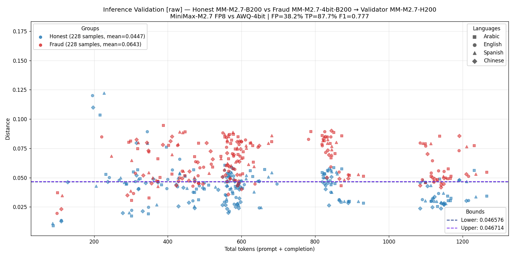
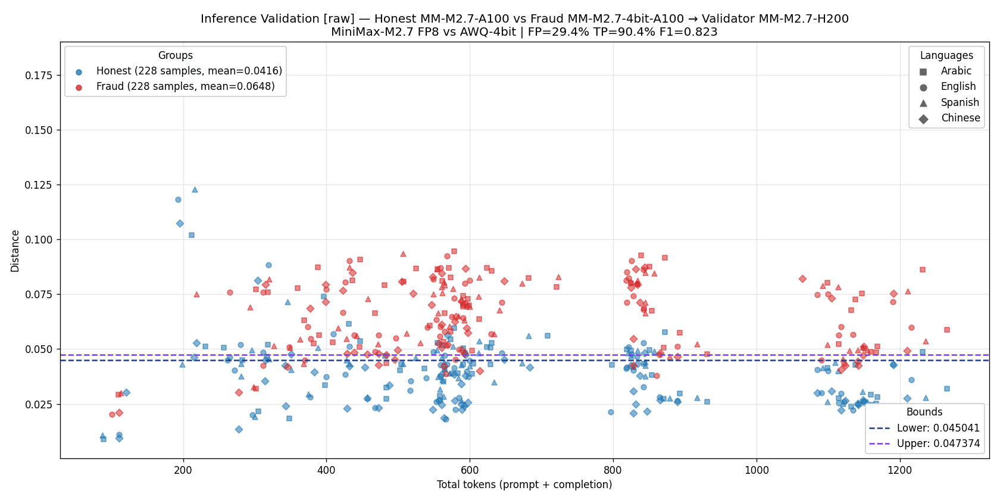
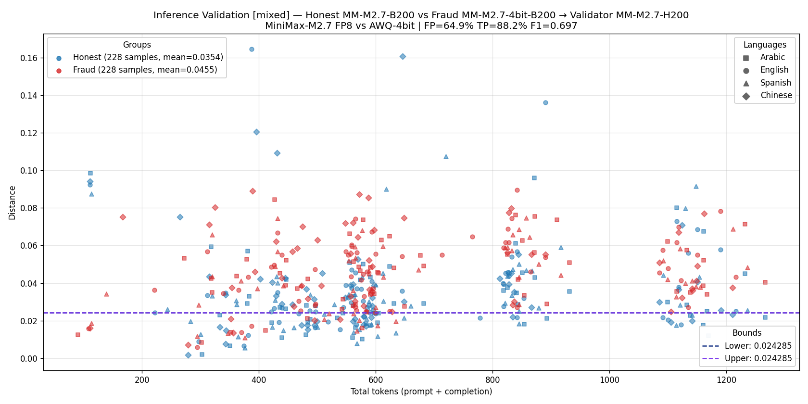
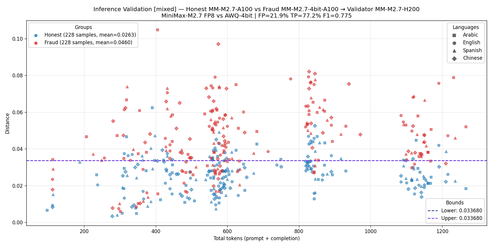

# MiniMax-M2.7 cross-arch fraud detection — 2026-06-07

Cross-architecture test of **MiniMax-M2.7 FP8** (honest model) vs **MiniMax-M2.7-AWQ-4bit** (fraud model) on **2×B200** and **4×A100**, validated against **2×H200** as an independent third architecture, in both `raw_logprobs` and `processed_logprobs` modes.

Each executor's 228 prompts were replayed through the H200 validator using `enforced_tokens` (chain-style validation: validator scores the executor's exact token sequence position-by-position, no free generation). Distance plotted = `1 − customSimilarity` from the chain validator algorithm.

> **Note on the `--logprobs-mode raw_logprobs` fix (2026-06-07)**: an earlier sweep had ~17.5% of validations (every `tool_*` / `rf_*` / `multi_turn_*` prompt) collapsing to similarity ≈ 0.6 with ~10-15% of positions at `logprob = -9999`. Root cause: vLLM's `detect_logprobs_mode()` heuristic ([vllm/validation.py:51](../../vllm/validation.py#L51)) misclassified raw inputs whose top-K naturally contains many low-ID tokens (JSON `{`, `"`, etc.) as `processed`, silently switching the validator into processed mode → schema mask got applied to top_logprobs → -9999 sentinels at every forced position not in the schema-allowed set. **Fix:** `e2e infer` and `e2e validate` now pin `logprobs_mode` per-request body (in addition to vLLM server startup), bypassing the heuristic. All inference plots below were re-generated against H200 after the fix. The chosen mode is `raw_logprobs` everywhere (executor + validator).

## Inference validation plots — validator = H200 (independent third architecture)

**Figure 1.** Inference validation, `raw_logprobs` mode.
**Honest:** MiniMax-M2.7 FP8 on **2×B200**.  **Fraud:** MiniMax-M2.7-AWQ-4bit on **2×B200**.  **Validator:** MiniMax-M2.7 FP8 on **2×H200**.
Point shapes encode language (○ en, △ es, ☐ ar, ◆ zh).

---

**Figure 2.** Inference validation, `raw_logprobs` mode.
**Honest:** MiniMax-M2.7 FP8 on **4×A100**.  **Fraud:** MiniMax-M2.7-AWQ-4bit on **4×A100**.  **Validator:** MiniMax-M2.7 FP8 on **2×H200**.

---

**Figure 3.** Inference validation, `processed_logprobs` mode.
**Honest:** MiniMax-M2.7 FP8 on **2×B200**.  **Fraud:** MiniMax-M2.7-AWQ-4bit on **2×B200**.  **Validator:** MiniMax-M2.7 FP8 on **2×H200**.

---

**Figure 4.** Inference validation, `processed_logprobs` mode.
**Honest:** MiniMax-M2.7 FP8 on **4×A100**.  **Fraud:** MiniMax-M2.7-AWQ-4bit on **4×A100**.  **Validator:** MiniMax-M2.7 FP8 on **2×H200**.

---

## How to read the plots

- **Y-axis** = distance per prompt (`1 − customSimilarity`, chain validator formula). Honest (blue) should sit lower; fraud (red) should sit higher.
- **X-axis** = `usage.total_tokens` (prompt + completion).
- **Dashed bands** (Lower, Upper) — the F1-optimal threshold range. Any value in [Lower, Upper] gives the same maximum F1; a single value means the F1 plateau is a single point.
- **Honest / Fraud means in the legend** — average distance for the group.

## Summary of metrics (post-fix, validator = H200)

| direction | mode | honest mean | fraud mean | Δ | F1 | TP | FP |
|---|---|---:|---:|---:|---:|---:|---:|
| B200 (exec) → H200 (val) | raw       | 0.0447 | 0.0643 | 0.0196 | 0.777     | 87.7% | 38.2% |
| **A100 (exec) → H200 (val)** | **raw** | 0.0416 | 0.0648 | 0.0232 | **0.823** | 90.4% | **29.4%** |
| B200 (exec) → H200 (val) | processed | 0.0354 | 0.0455 | 0.0101 | 0.697     | 88.2% | 64.9% |
| A100 (exec) → H200 (val) | processed | 0.0263 | 0.0460 | 0.0197 | 0.775     | 77.2% | **21.9%** |

**Mode comparison**:
- **`raw`** beats `processed` on F1 in both directions (0.777 vs 0.697 on B200; 0.823 vs 0.775 on A100) — the chain validator's distance separates honest from fraud more cleanly when top-K logprobs are unmasked.
- **`processed`** compresses both means (honest 0.045 → 0.035; fraud 0.064 → 0.046) because schema-masking + temperature processing equalize the post-sampler distributions. Honest/fraud Δ shrinks accordingly.
- B200 `processed` has the highest FP (64.9%) — Blackwell native FP8 paired with processed-mode masking pulls honest and fraud means closest together.
- A100 `processed` has the lowest FP (21.9%) but at the cost of TP (77.2%) — marlin emulation already smears the distribution, so the additional processing helps separation by penalizing fraud's outliers harder.

For reference, the pre-fix raw numbers (same prompts, same data, before `logprobs_mode` was pinned per-request) were:

| direction | F1 pre | TP pre | FP pre |
|---|---:|---:|---:|
| B200 (exec) → H200 (val) | 0.763 | 95.2% | 54.4% |
| A100 (exec) → H200 (val) | 0.809 | 91.2% | 34.2% |

The dominant effect of the fix is on **false positives**: raw B200 FP 54.4% → 38.2% (-16.2 pp); raw A100 FP 34.2% → 29.4% (-4.8 pp). TP nominally drops (95.2% → 87.7% on B200) because the F1-optimal threshold shifts after the schema-constrained `rf_*` / `tool_*` honest prompts return to their natural similarity range (~0.95+ instead of ~0.6).

## Per-prompt-class behaviour (post-fix)

Honest B200 → H200, samples:

| prompt | sentinels (pre) | sentinels (post) | similarity (pre) | similarity (post) |
|---|---:|---:|---:|---:|
| `rf_product_spec_en` | 14 / 82 | **0 / 82** | 0.66 | **0.83** |
| `rf_user_profile_en` | (problematic) | **0 / 175** | low | **0.95** |
| `tool_currency_convert_en` | (problematic) | **0 / 76** | low | **0.97** |
| `math_arithmetic_en` | 0 / 513 | 0 / 513 | 0.98 | 0.98 |

`rf_product_spec_en` is the only prompt that remains below the 0.9 pass threshold post-fix — likely real B200 ↔ H200 numerical drift on that specific schema, not the heuristic bug.

## Key takeaways

1. **Honest mean < Fraud mean in all four directions** — the metric separates FP8 from AWQ-4bit across architectures (B200 → H200, A100 → H200) in both raw and processed modes.
2. **`raw` gives larger separation than `processed`** (Δ ≈ 0.020–0.023 vs 0.010–0.020). Processed mode applies temperature / mask transformations that compress logit ranges, blurring the FP8↔AWQ gap.
3. **A100 → H200 raw is the best single configuration** (F1 = 0.823, FP = 29.4%) — A100 marlin's emulation noise on the executor side combines with H200's clean native FP8 on validator side to spread fraud farther from honest. Production recommendation for chain validators.
4. **`--logprobs-mode` MUST be pinned per-request body** for `enforced_tokens` validation. vLLM's auto-detect heuristic mis-classifies raw inputs containing JSON / tool / structured-output prompts. See [`docs/gotchas.md`](../../docs/gotchas.md) and [`docs/commands.md`](../../docs/commands.md).
5. **A100 marlin caveat** (PoC only, see PoC L2 plots below): PoC nonce vectors on A100 are not bit-identical between `raw` and `processed` (L2 ≈ 0.12–0.19 per nonce). On B200 they are bit-identical. Marlin's CUDA-graph capture depends on logprobs-mode → always compare runs in the SAME logprobs-mode.

## Test setup

### Executor datasets (228 prompts each)

228 prompts = 25 base themes × 4 langs (en/es/ar/zh) + 5 `tools` themes × 4 langs + 5 `response_format` themes × 4 langs + 1 multi-turn theme × 4 langs. Inferences saved in `MiniMax-M2.7-<gpu>-fp8/` (honest) and `MiniMax-M2.7-AWQ-4bit-<gpu>-fp8/` (fraud).

### Validation runs

For every executor inference, the H200 validator was POSTed the same prompt with `enforced_tokens = executor's token sequence`. The validator returned its top-5 logprobs at each forced position; `customSimilarity` compares the two top-5 logprob distributions.

Validations land as `validated-by-2xh200-fp8-1.json` inside each executor's label dir.

### Deploy configs

All deploys use `--kv-cache-dtype fp8 --enable-auto-tool-choice --tool-call-parser minimax_m2 --reasoning-parser minimax_m2_append_think`. Per-GPU tuning:

| GPU | TP | gpu-mem-util | extra args | image |
|---|---:|---:|---|---|
| 2×B200 | 2 | 0.92 | `--disable-custom-all-reduce --kv-cache-dtype fp8` | `kaitakuai/vllm:0.20.0-pocv2` |
| 2×H200 | 2 | 0.95 (tighter — 140 GB) | `--disable-custom-all-reduce --kv-cache-dtype fp8` | `kaitakuai/vllm:0.20.0-pocv2` |
| 4×A100 | 4 | 0.92 | `--moe-backend marlin --disable-custom-all-reduce --kv-cache-dtype fp8` | `gonka-ai/mlnode:3.0.14-cu129` |

### PoC throughput (1024 nonces per dataset, batch_size=32)

| run dir | model | GPU | mode | nonces/min |
|---|---|---|---|---:|
| `MiniMax-M2.7-2xb200-fp8`                    | FP8        | 2×B200 | raw       | 2333 |
| `MiniMax-M2.7-2xb200-fp8-processed`          | FP8        | 2×B200 | processed | 2336 |
| `MiniMax-M2.7-AWQ-4bit-2xb200-fp8`           | AWQ-4bit   | 2×B200 | raw       | 1234 |
| `MiniMax-M2.7-AWQ-4bit-2xb200-fp8-processed` | AWQ-4bit   | 2×B200 | processed | 1259 |
| `MiniMax-M2.7-4xa100-fp8`                    | FP8        | 4×A100 | raw       |  811 |
| `MiniMax-M2.7-4xa100-fp8-processed`          | FP8        | 4×A100 | processed |  793 |
| `MiniMax-M2.7-AWQ-4bit-4xa100-fp8`           | AWQ-4bit   | 4×A100 | raw       |  843 |
| `MiniMax-M2.7-AWQ-4bit-4xa100-fp8-processed` | AWQ-4bit   | 4×A100 | processed |  853 |

Numbers are honest end-to-end (POST `/pow/init/generate` → response from `/pow/stop`).

### PoC nonce-L2 plots (for reference)

PoC L2-distance plots compare per-nonce vector L2 between honest and fraud, validated against a third FP8 node. F1 ≈ 0.86–0.87 in all 4 directions. Saved in [`_plots/`](_plots/):
- [`01_poc_raw_B200_vs_A100.png`](_plots/01_poc_raw_B200_vs_A100.png), [`03_poc_processed_B200_vs_A100.png`](_plots/03_poc_processed_B200_vs_A100.png)
- [`05_poc_raw_A100_vs_B200.png`](_plots/05_poc_raw_A100_vs_B200.png), [`07_poc_processed_A100_vs_B200.png`](_plots/07_poc_processed_A100_vs_B200.png)
