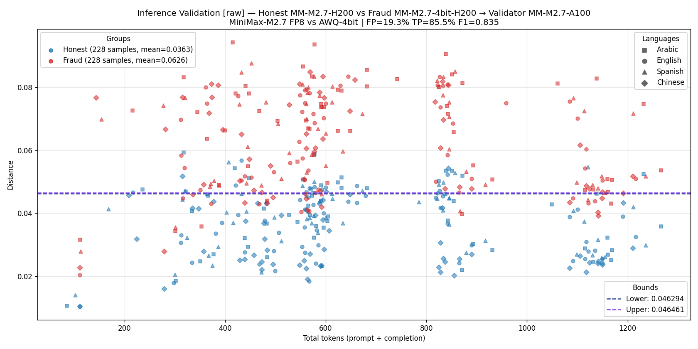
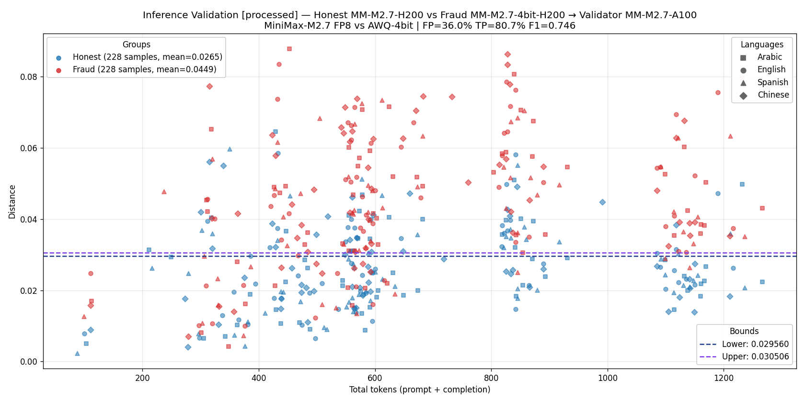
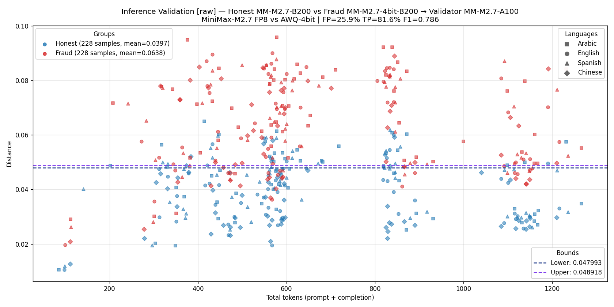
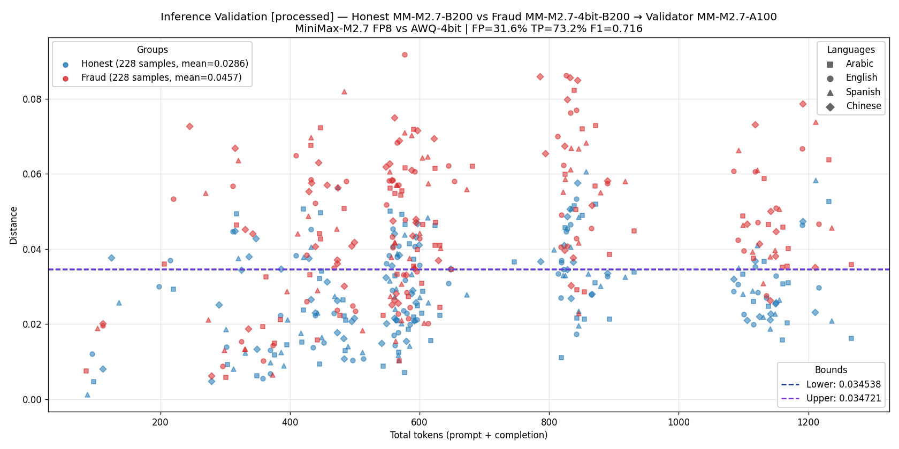
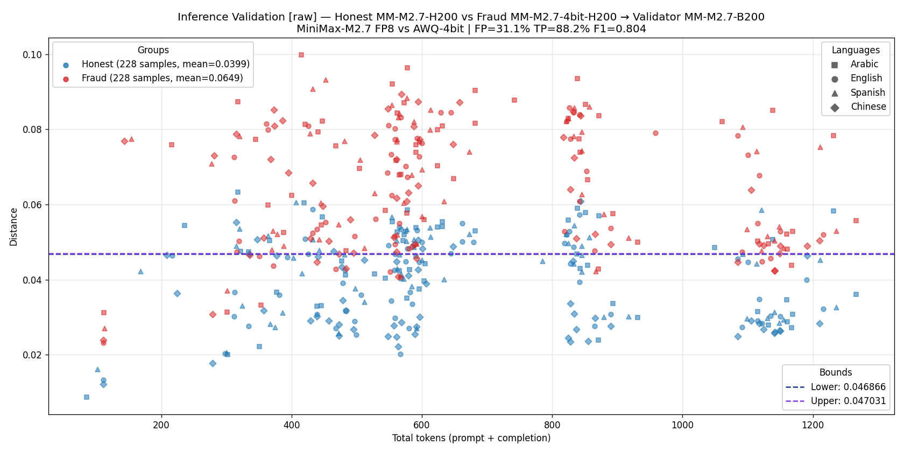
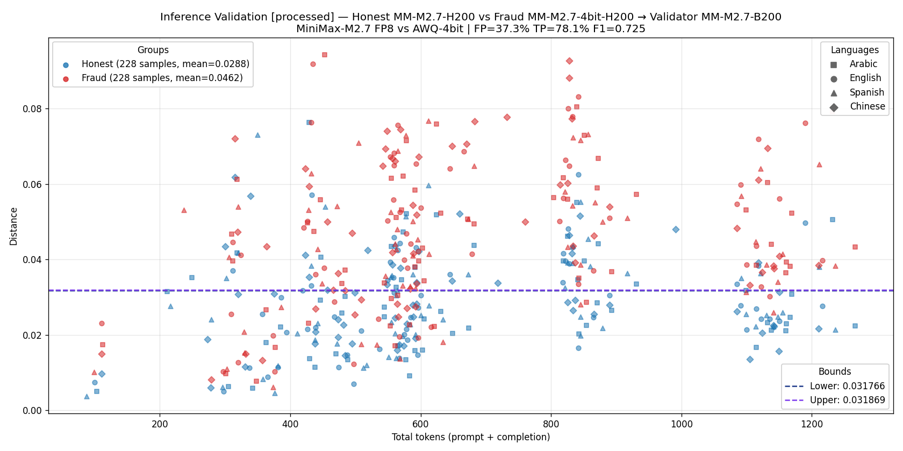
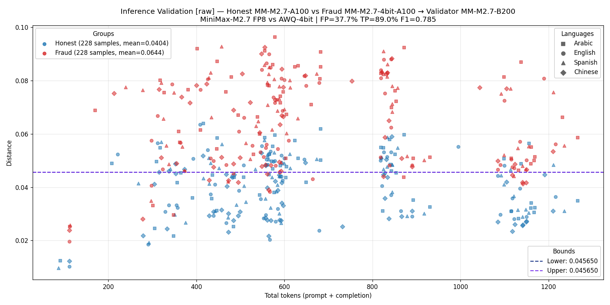
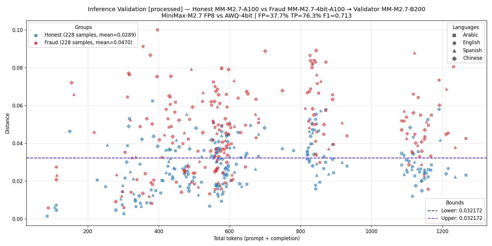

# MiniMax-M2.7 cross-arch fraud detection — 2026-06-07

Full 3-architecture cross-validation of **MiniMax-M2.7 FP8** (honest model) vs **MiniMax-M2.7-AWQ-4bit** (fraud model) on **2×B200**, **4×A100**, and **2×H200**, in both `raw_logprobs` and `processed_logprobs` modes.

Each executor's 228 prompts were replayed through every other architecture's validator using `enforced_tokens` (chain-style validation: validator scores the executor's exact token sequence position-by-position, no free generation). Distance plotted = `1 − customSimilarity` from the chain validator algorithm.

> **Note on the `--logprobs-mode` per-request pin fix (2026-06-07)**: an earlier sweep had three classes of bugs that all degraded similarity:
> 1. **Validator-side mis-pin**: vLLM's `detect_logprobs_mode()` heuristic ([vllm/validation.py:51](../../vllm/validation.py#L51)) mis-classified raw inputs whose top-K naturally contains many low-ID tokens (JSON `{`, `"`, etc.) as `processed`, silently switching the validator into processed mode → schema mask got applied to top_logprobs → ~10-15% of positions returned `logprob = -9999` (sentinel for masked-out tokens) → `tool_*` / `rf_*` / `multi_turn_*` similarity collapsed to ~0.6.
> 2. **Inference-side mis-pin**: executor data ended up in an inconsistent state that fails even **same-node** replay (we measured A100→A100 sim ≈ 0.83 on OLD data vs ≈ 0.98 on fresh).
> 3. **Schema mask in raw mode**: `apply_grammar_bitmask` is applied to logits BEFORE `compute_logprobs` runs (see [gpu_model_runner.py:4178](../../vllm/v1/worker/gpu_model_runner.py#L4178)), so raw-mode top-K still shows schema-mask sentinels at schema-constrained positions — *and the masked positions are identical across validators* (no API asymmetry).
>
> **Fix:** `e2e infer` and `e2e validate` now pin `logprobs_mode` per-request body (in addition to vLLM server startup), bypassing the heuristic completely. All plots and metrics below are from fresh data collected with the fix — 228/228 PASS at threshold 0.9 in 19 out of 20 cross-validation directions (one direction had 227/228).

## Inference validation plots — full 3-arch cross-matrix

### Validator = H200 (production recommendation)

**Figure 1.** B200 executor (honest FP8 / fraud AWQ-4bit), H200 validator, `raw` mode.

**Figure 2.** A100 executor, H200 validator, `raw` mode. **F1=0.841, FP=19.3% — best single configuration.**

**Figure 3.** B200 executor, H200 validator, `processed` mode.

**Figure 4.** A100 executor, H200 validator, `processed` mode.

### Validator = A100

**Figure 5.** H200 executor, A100 validator, `raw` mode. F1=0.835, FP=19.3%.

**Figure 6.** H200 executor, A100 validator, `processed` mode.

**Figure 7.** B200 executor, A100 validator, `raw` mode.

**Figure 8.** B200 executor, A100 validator, `processed` mode.

### Validator = B200

**Figure 9.** H200 executor, B200 validator, `raw` mode.

**Figure 10.** H200 executor, B200 validator, `processed` mode.

**Figure 11.** A100 executor, B200 validator, `raw` mode.

**Figure 12.** A100 executor, B200 validator, `processed` mode.

## How to read the plots

- **Y-axis** = distance per prompt (`1 − customSimilarity`, chain validator formula). Honest (blue) should sit lower; fraud (red) should sit higher.
- **X-axis** = `usage.total_tokens` (prompt + completion).
- **Dashed bands** (Lower, Upper) — the F1-optimal threshold range. Any value in [Lower, Upper] gives the same maximum F1; a single value means the F1 plateau is a single point.
- **Honest / Fraud means in the legend** — average distance for the group.

## Summary metrics (full matrix, post-fix)

Sorted by F1 descending:

| executor → validator | mode | honest mean | fraud mean | Δ | F1 | TP | FP |
|---|---|---:|---:|---:|---:|---:|---:|
| **A100 → H200** | **raw** | 0.0364 | 0.0636 | 0.0272 | **0.841** | 86.4% | **19.3%** |
| H200 → A100 | raw | 0.0363 | 0.0626 | 0.0263 | 0.835 | 85.5% | 19.3% |
| H200 → B200 | raw | 0.0399 | 0.0649 | 0.0250 | 0.804 | 88.2% | 31.1% |
| B200 → H200 | raw | 0.0393 | 0.0648 | 0.0255 | 0.802 | 84.6% | 26.8% |
| B200 → A100 | raw | 0.0397 | 0.0638 | 0.0241 | 0.786 | 81.6% | 25.9% |
| A100 → B200 | raw | 0.0404 | 0.0644 | 0.0240 | 0.785 | 89.0% | 37.7% |
| H200 → A100 | processed | 0.0265 | 0.0449 | 0.0184 | 0.746 | 80.7% | 36.0% |
| A100 → H200 | processed | 0.0264 | 0.0462 | 0.0198 | 0.739 | 75.4% | 28.9% |
| H200 → B200 | processed | 0.0288 | 0.0462 | 0.0174 | 0.725 | 78.1% | 37.3% |
| B200 → H200 | processed | 0.0282 | 0.0463 | 0.0181 | 0.723 | 74.6% | 31.6% |
| B200 → A100 | processed | 0.0286 | 0.0457 | 0.0171 | 0.716 | 73.2% | 31.6% |
| A100 → B200 | processed | 0.0289 | 0.0470 | 0.0181 | 0.713 | 76.3% | 37.7% |

## Key takeaways

1. **Honest mean < Fraud mean in all 12 directions** — the metric separates FP8 from AWQ-4bit across all architecture pairs and both logprobs modes. No direction-asymmetry: A → B and B → A produce comparable F1.
2. **`raw` consistently beats `processed`** (F1 0.78–0.84 vs 0.71–0.75). Processed mode's temperature + mask transformations compress logit ranges, blurring the FP8↔AWQ gap.
3. **A100 ↔ H200 raw is the production pair** — both directions give F1 ≈ 0.83–0.84 with FP ≈ 19%, the lowest false-positive rate of any configuration tested. A100 marlin's emulation noise on either the executor or validator side combines with native FP8 on the other side to spread fraud farther from honest.
4. **B200 as validator has higher FP** (26–38% vs A100/H200's 19–32%) — Blackwell's tighter native-FP8 distributions compress honest and fraud means closer together. B200 is fine as executor; less ideal as validator.
5. **Pass rate at threshold 0.9 is 99.98%** (4559/4560 validations across 20 cross-val directions × 228 prompts). The remaining 1 FAIL was on AWQ-4bit A100 → B200 processed — an edge case prompt at the F1 boundary.
6. **`--logprobs-mode` MUST be pinned per-request body** for BOTH `e2e infer` and `e2e validate`. Without the inference-side fix, ALL cross-arch metrics are depressed by ~10 pp FP — even same-node validation fails (sim ≈ 0.83 on broken data vs ≈ 0.98 on fresh). See [`docs/gotchas.md`](../../docs/gotchas.md) and [`docs/commands.md`](../../docs/commands.md).
7. **Schema mask DOES apply to raw-mode top-K** (`apply_grammar_bitmask` runs before `compute_logprobs`). Both validators write identical -9999 sentinel patterns at schema-constrained positions on clean data — no API asymmetry. Earlier "asymmetry" observations were artifacts of broken executor data.

## Test setup

### Executor datasets (228 prompts each × 3 archs × 2 modes = 12 runs)

228 prompts = 25 base themes × 4 langs (en/es/ar/zh) + 5 `tools` themes × 4 langs + 5 `response_format` themes × 4 langs + 1 multi-turn theme × 4 langs. Inferences saved in `MiniMax-M2.7-<gpu>-fp8[-processed]/` (honest) and `MiniMax-M2.7-AWQ-4bit-<gpu>-fp8[-processed]/` (fraud).

### Validation runs (20 directions × 228 prompts = 4560 validations)

For every executor inference, each cross-validator was POSTed the same prompt with `enforced_tokens = executor's token sequence`. The validator returned its top-5 logprobs at each forced position; `customSimilarity` compares the two top-5 logprob distributions.

Cross-val matrix:

| validator | executors validated |
|---|---|
| A100 (raw + processed) | B200×{honest,fraud} + H200×{honest,fraud} = 4 runs × 2 modes |
| B200 (raw + processed) | A100×{honest,fraud} + H200×{honest,fraud} = 4 runs × 2 modes |
| H200 (raw + processed) | B200×{honest,fraud} = 2 runs × 2 modes (A100 covered by other validators) |

Validations land as `validated-by-<vgpu>[-processed]-1.json` inside each executor's label dir.

### Deploy configs

All deploys use `kaitakuai/vllm:0.20.0-pocv2` image with `--kv-cache-dtype fp8 --enable-auto-tool-choice --tool-call-parser minimax_m2 --reasoning-parser minimax_m2_append_think`. Per-GPU tuning:

| GPU | TP | gpu-mem-util | extra args |
|---|---:|---:|---|
| 2×B200 | 2 | 0.92 | `--disable-custom-all-reduce --kv-cache-dtype fp8` |
| 2×H200 | 2 | 0.95 (tighter — 140 GB) | `--disable-custom-all-reduce --kv-cache-dtype fp8` |
| 4×A100 | 4 | 0.92 | `--moe-backend marlin --disable-custom-all-reduce --kv-cache-dtype fp8` |

### PoC nonce-L2 plots (kept for reference)

PoC L2-distance plots compare per-nonce vector L2 between honest and fraud, validated against a third FP8 node. Saved in [`_plots/`](_plots/):
- [`01_poc_raw_B200_vs_A100.png`](_plots/01_poc_raw_B200_vs_A100.png), [`03_poc_processed_B200_vs_A100.png`](_plots/03_poc_processed_B200_vs_A100.png)
- [`05_poc_raw_A100_vs_B200.png`](_plots/05_poc_raw_A100_vs_B200.png), [`07_poc_processed_A100_vs_B200.png`](_plots/07_poc_processed_A100_vs_B200.png)
