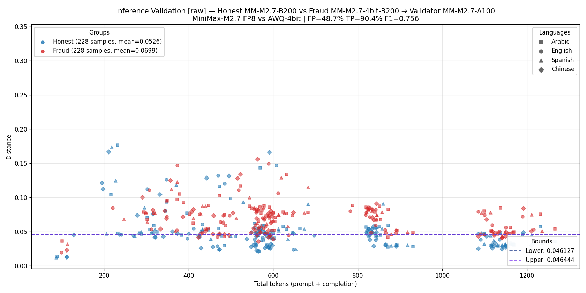
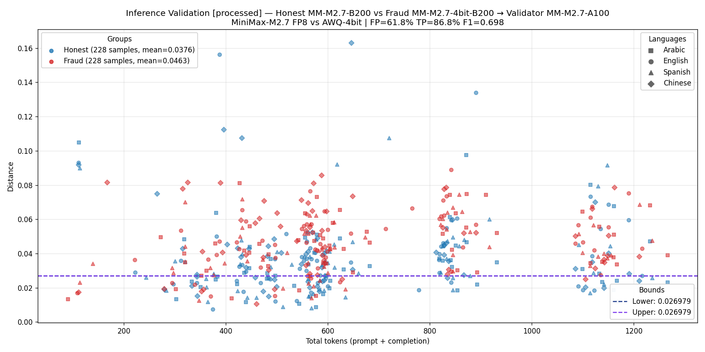
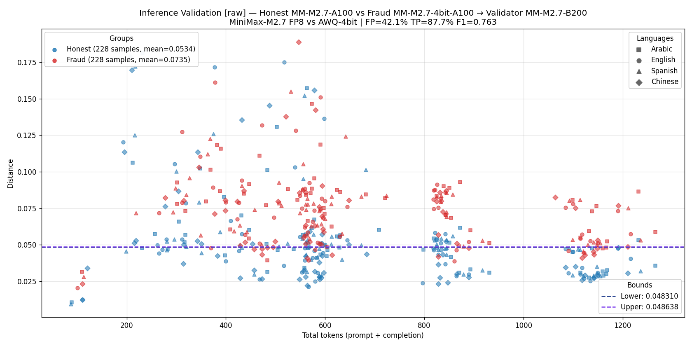
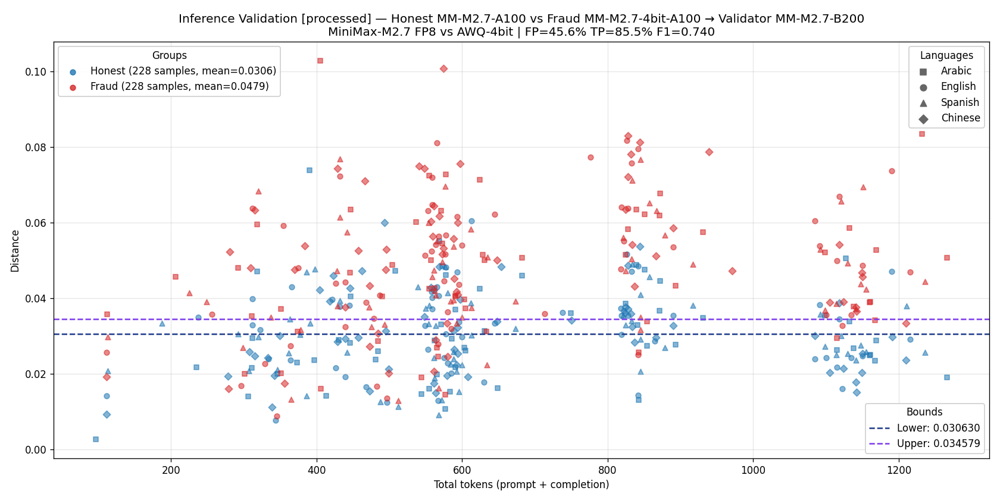

# MiniMax-M2.7 cross-arch fraud detection — 2026-06-07

Cross-architecture test of **MiniMax-M2.7 FP8** (honest model) vs **MiniMax-M2.7-AWQ-4bit** (fraud model) on **2×B200** and **4×A100**, in both `raw_logprobs` and `processed_logprobs` modes.

Each executor's 228 prompts were replayed through a validator running FP8 on the OTHER GPU using `enforced_tokens` (chain-style validation: validator scores the executor's exact token sequence position-by-position, no free generation). Distance plotted = `1 − customSimilarity` from the chain validator algorithm.

## Inference validation plots

**Figure 1.** Inference validation, `raw_logprobs` mode.
**Honest:** MiniMax-M2.7 FP8 on **2×B200**.  **Fraud:** MiniMax-M2.7-AWQ-4bit on **2×B200**.  **Validator:** MiniMax-M2.7 FP8 on **4×A100**.
Point shapes encode language (○ en, △ es, ☐ ar, ◆ zh).

---

**Figure 2.** Inference validation, `processed_logprobs` mode.
**Honest:** MiniMax-M2.7 FP8 on **2×B200**.  **Fraud:** MiniMax-M2.7-AWQ-4bit on **2×B200**.  **Validator:** MiniMax-M2.7 FP8 on **4×A100**.

---

**Figure 3.** Inference validation, `raw_logprobs` mode.
**Honest:** MiniMax-M2.7 FP8 on **4×A100**.  **Fraud:** MiniMax-M2.7-AWQ-4bit on **4×A100**.  **Validator:** MiniMax-M2.7 FP8 on **2×B200**.

---

**Figure 4.** Inference validation, `processed_logprobs` mode.
**Honest:** MiniMax-M2.7 FP8 on **4×A100**.  **Fraud:** MiniMax-M2.7-AWQ-4bit on **4×A100**.  **Validator:** MiniMax-M2.7 FP8 on **2×B200**.

---

## How to read the plots

- **Y-axis** = distance per prompt (`1 − customSimilarity`, chain validator formula). Honest (blue) should sit lower; fraud (red) should sit higher.
- **X-axis** = `usage.total_tokens` (prompt + completion).
- **Dashed bands** (Lower, Upper) — the F1-optimal threshold range. Any value in [Lower, Upper] gives the same maximum F1; a single value means the F1 plateau is a single point.
- **Title `[raw]` / `[processed]`** — `--logprobs-mode` used by ALL THREE runs (must be the same).
- **Honest / Fraud means in the legend** — average distance for the group.

## Summary of metrics

| direction | mode | honest mean | fraud mean | Δ | F1 | TP | FP |
|---|---|---:|---:|---:|---:|---:|---:|
| B200 (exec) → A100 (val) | raw | 0.053 | 0.070 | **0.017** | 0.756 | 90.4% | 48.7% |
| B200 (exec) → A100 (val) | processed | 0.038 | 0.046 | 0.009 | 0.698 | 86.8% | 61.8% |
| A100 (exec) → B200 (val) | raw | 0.053 | 0.074 | **0.020** | 0.763 | 87.7% | 42.1% |
| A100 (exec) → B200 (val) | processed | 0.031 | 0.048 | 0.017 | 0.740 | 85.5% | 45.6% |

## Key takeaways

1. **Honest mean < Fraud mean across all 4 directions** — the metric separates FP8 from AWQ-4bit in both `raw` and `processed` modes, both directions.
2. **`raw` gives larger separation than `processed`** (Δ≈0.017–0.020 vs 0.009–0.017). Processed mode applies temperature / mask transformations that compress logit ranges, blurring the FP8↔AWQ gap especially on `response_format` / `tools` prompts.
3. **Direction-symmetric**: B200→A100 and A100→B200 produce near-identical means and F1 — the metric is not biased to either box being honest or fraud.
4. **A100 marlin caveat**: PoC nonce vectors on A100 are not bit-identical between `raw` and `processed` (L2 ≈ 0.12–0.19 per nonce). On B200 they are bit-identical. Marlin's CUDA-graph capture depends on logprobs-mode → always compare runs in the SAME logprobs-mode.

## Test setup

### Executor datasets (228 prompts each)

228 prompts = 25 base themes × 4 langs (en/es/ar/zh) + 5 `tools` themes × 4 langs + 5 `response_format` themes × 4 langs + 1 multi-turn theme × 4 langs. Inferences saved in `MiniMax-M2.7-<gpu>-<mode>/` and `MiniMax-M2.7-AWQ-4bit-<gpu>-<mode>/`.

### Validation runs

For every executor inference, the validator was POSTed the same prompt with `enforced_tokens = executor's token sequence`. The validator returned its top-5 logprobs at each forced position; `customSimilarity` compares the two top-5 logprob distributions.

Validations land as `validated-by-<vgpu>-1.json` inside each executor's label dir.

### Deploy configs

All deploys use `--kv-cache-dtype fp8 --enable-auto-tool-choice --tool-call-parser minimax_m2 --reasoning-parser minimax_m2_append_think`. Per-GPU tuning:

| GPU | TP | gpu-mem-util | extra args | image |
|---|---:|---:|---|---|
| 2×B200 | 2 | 0.92 | `--disable-custom-all-reduce --kv-cache-dtype fp8` | `kaitakuai/vllm:0.20.0-pocv2` |
| 4×A100 | 4 | 0.92 | `--moe-backend marlin --disable-custom-all-reduce --kv-cache-dtype fp8` | `gonka-ai/mlnode:3.0.14-cu129` |

### PoC throughput (1024 nonces per dataset, batch_size=32)

| run dir | model | GPU | mode | nonces/min |
|---|---|---|---|---:|
| `MiniMax-M2.7-2xb200-fp8`                    | FP8        | 2×B200 | raw       | 2333 |
| `MiniMax-M2.7-2xb200-fp8-processed`          | FP8        | 2×B200 | processed | 2336 |
| `MiniMax-M2.7-AWQ-4bit-2xb200-fp8`           | AWQ-4bit   | 2×B200 | raw       | 1234 |
| `MiniMax-M2.7-AWQ-4bit-2xb200-fp8-processed` | AWQ-4bit   | 2×B200 | processed | 1259 |
| `MiniMax-M2.7-4xa100-fp8`                    | FP8        | 4×A100 | raw       |  811 |
| `MiniMax-M2.7-4xa100-fp8-processed`          | FP8        | 4×A100 | processed |  793 |
| `MiniMax-M2.7-AWQ-4bit-4xa100-fp8`           | AWQ-4bit   | 4×A100 | raw       |  843 |
| `MiniMax-M2.7-AWQ-4bit-4xa100-fp8-processed` | AWQ-4bit   | 4×A100 | processed |  853 |

Numbers are honest end-to-end (POST `/pow/init/generate` → response from `/pow/stop`).

### PoC nonce-L2 plots (for reference)

PoC L2-distance plots compare per-nonce vector L2 between honest and fraud, validated against a third FP8 node. F1 ≈ 0.86–0.87 in all 4 directions. Saved in [`_plots/`](_plots/):
- [`01_poc_raw_B200_vs_A100.png`](_plots/01_poc_raw_B200_vs_A100.png), [`03_poc_processed_B200_vs_A100.png`](_plots/03_poc_processed_B200_vs_A100.png)
- [`05_poc_raw_A100_vs_B200.png`](_plots/05_poc_raw_A100_vs_B200.png), [`07_poc_processed_A100_vs_B200.png`](_plots/07_poc_processed_A100_vs_B200.png)
