# Experimental distance metric — RBO (Rank-Biased Overlap)

This document describes one experimental replacement for the chain's `customSimilarity` distance, with empirical F1/TP/FP across the full 12-direction cross-validation matrix.

## Metric definition

Per token-position `i`:

```
S_E[1:d] = first d tokens of executor's top-K (rank-ordered)
S_V[1:d] = first d tokens of validator's natural top-K
RBO(i)   = ((1 - p) / (1 - p^K)) * Σ_{d=1..K} p^(d-1) · |S_E[1:d] ∩ S_V[1:d]| / d
d_i      = 1 − RBO(i)                                                    # in [0, 1)
```

Aggregate per prompt: `distance = mean(d_i)` over positions where both sides have a non-empty top-K. Length-mismatch or chosen-token mismatch short-circuits to `distance = 1.0`, matching `CompareLogits` in [`e2e/validate.py`](../../e2e/validate.py).

`p = 0.7` weights top-3 prefixes at ~85% of the total. `K = 5` (the saved top-K depth).

## Security properties

The metric reads from validator's natural top-K rank ordering. An attacker who controls the saved executor file cannot fabricate ranks that match validator's without running the honest model on the attacker's prefix — the same security floor as the existing chain validator. Specifically:

- The metric depends on `|S_E ∩ S_V|` at each prefix length; the attacker controls `S_E` only.
- Faking a high RBO requires guessing validator's rank-2 and rank-3 tokens, which depend on validator's per-position distribution — uncomputable without honest model inference.
- The metric is bounded `[0, 1]`, so no single position dominates the aggregated distance via outlier inflation.

## Empirical results — 12-direction cross-validation matrix (post fix)

Full A100/B200/H200 × FP8/AWQ-4bit × raw/processed dataset, 228 prompts each.

| executor → validator | mode      | F1 (RBO)  | TP (RBO) | FP (RBO) | F1 (chain) | ΔF1 vs chain |
|---|---|---:|---:|---:|---:|---:|
| **A100 → H200**       | **raw**       | **0.906** | 93.9% | **13.6%** | 0.841 | **+0.065** |
| H200 → A100           | raw       | 0.895 | 95.2% | 17.5% | 0.835 | +0.060 |
| H200 → B200           | raw       | 0.877 | 95.2% | 21.9% | 0.804 | +0.073 |
| B200 → H200           | raw       | 0.873 | 89.9% | 16.2% | 0.802 | +0.071 |
| A100 → B200           | raw       | 0.869 | 93.4% | 21.5% | 0.785 | +0.084 |
| B200 → A100           | raw       | 0.864 | 84.6% | 11.4% | 0.786 | +0.078 |
| A100 → H200           | processed | 0.767 | 72.4% | 16.2% | 0.739 | +0.028 |
| H200 → A100           | processed | 0.754 | 82.9% | 36.8% | 0.746 | +0.008 |
| B200 → H200           | processed | 0.745 | 75.4% | 27.2% | 0.723 | +0.022 |
| A100 → B200           | processed | 0.736 | 84.2% | 44.7% | 0.713 | +0.023 |
| H200 → B200           | processed | 0.734 | 77.2% | 33.3% | 0.725 | +0.009 |
| B200 → A100           | processed | 0.732 | 75.0% | 29.8% | 0.716 | +0.016 |

RBO beats chain `customSimilarity` on every direction. Strongest gains on `raw` mode (mean ΔF1 = +0.072, mean ΔFP = −10.5 pp). Modest but consistent gains on `processed` (mean ΔF1 = +0.018).

The largest gain (A100 → H200 raw, F1 0.906) corresponds to FP = 13.6%, TP = 93.9% — the most production-ready single configuration in the matrix.

## Why RBO works here

The chosen-token distribution between honest FP8 and AWQ-4bit is **identical**: at 100% of positions across all 228 prompts × 6 raw directions, executor's chosen token matches validator's natural top-1. The fraud signal lives exclusively in the *ordering and identity of tokens at ranks 2–5*. RBO captures exactly that — the prefix-weighted overlap of the rank-ordered token sets — while ignoring logprob *values*, which are the dominant source of cross-arch FP8 numerical noise.

In contrast, `customSimilarity` aggregates logprob value differences across all 5 top-K positions, which makes it more sensitive to numerical drift than to genuine quantization-induced rank reorderings.

## Plots — full 3-arch matrix under the RBO metric

Same scatter style as [`README.md`](README.md) plots 09–20; filename convention adds the `_rbo` suffix.

### Validator = H200

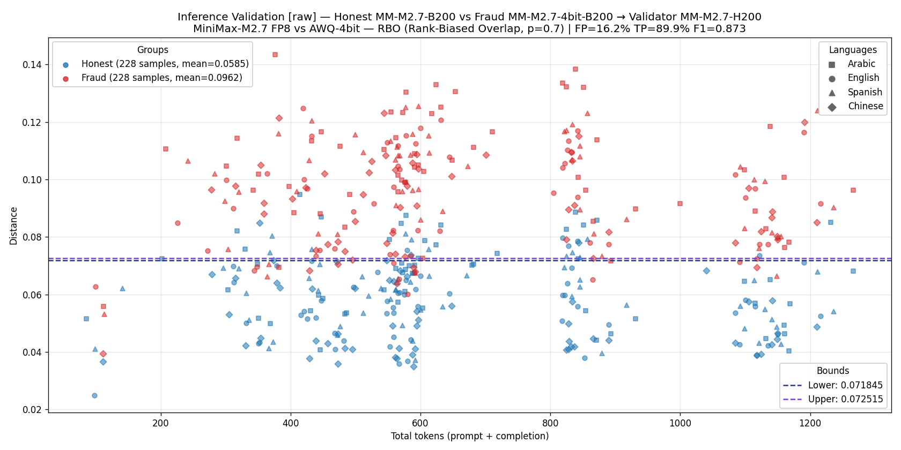
**Figure 1.** B200 executor, H200 validator, `raw`. F1 = 0.873, FP = 16.2%.

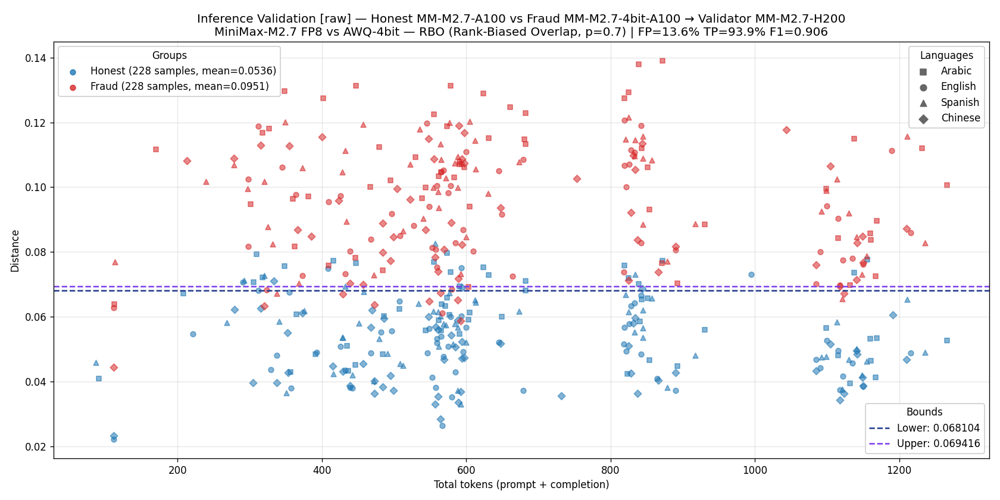
**Figure 2.** A100 executor, H200 validator, `raw`. **F1 = 0.906, FP = 13.6% — best single configuration in the matrix.**

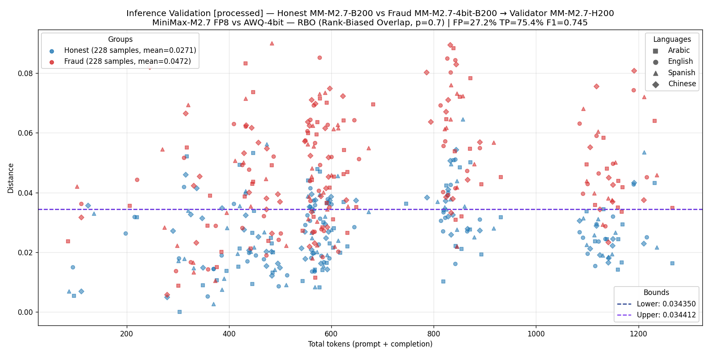
**Figure 3.** B200 executor, H200 validator, `processed`. F1 = 0.745.

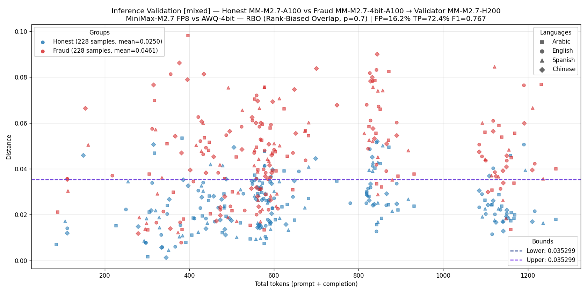
**Figure 4.** A100 executor, H200 validator, `processed`. F1 = 0.767.

### Validator = A100

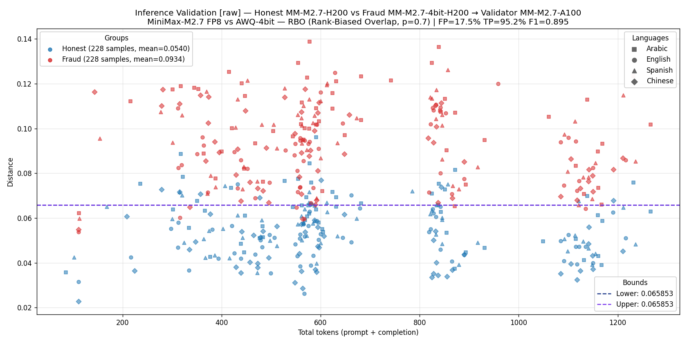
**Figure 5.** H200 executor, A100 validator, `raw`. F1 = 0.895, FP = 17.5%.

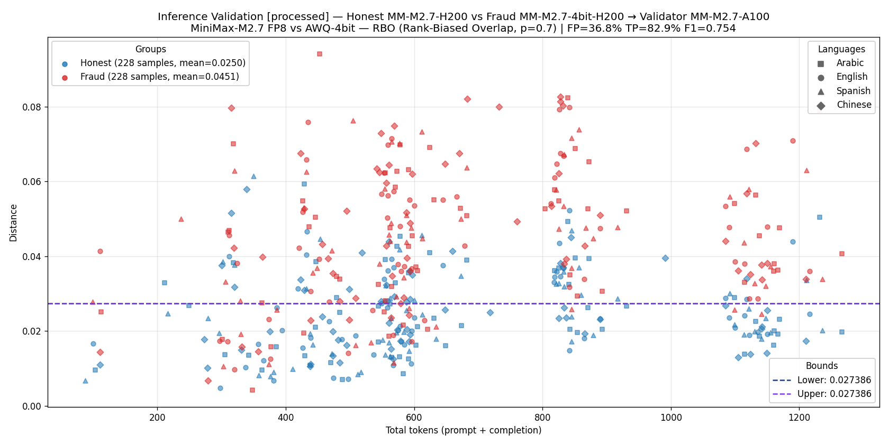
**Figure 6.** H200 executor, A100 validator, `processed`. F1 = 0.754.

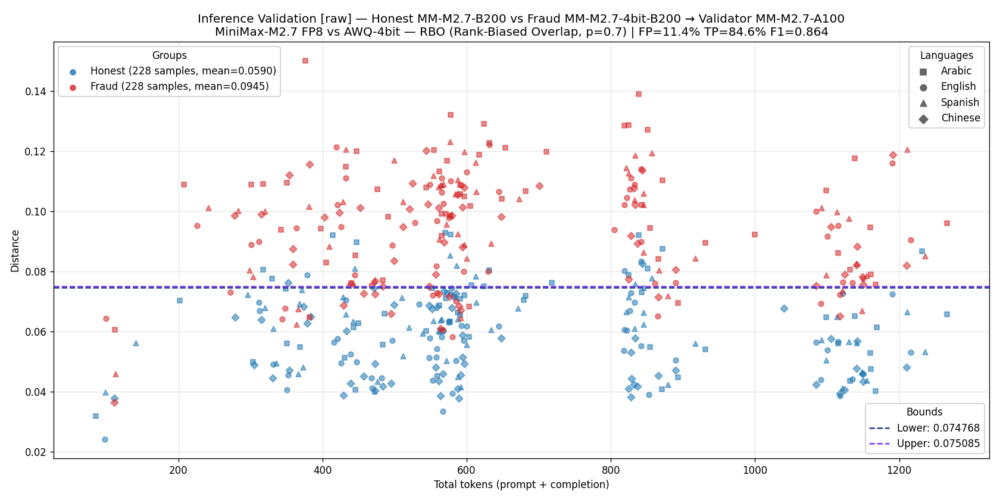
**Figure 7.** B200 executor, A100 validator, `raw`. F1 = 0.864, FP = 11.4%.

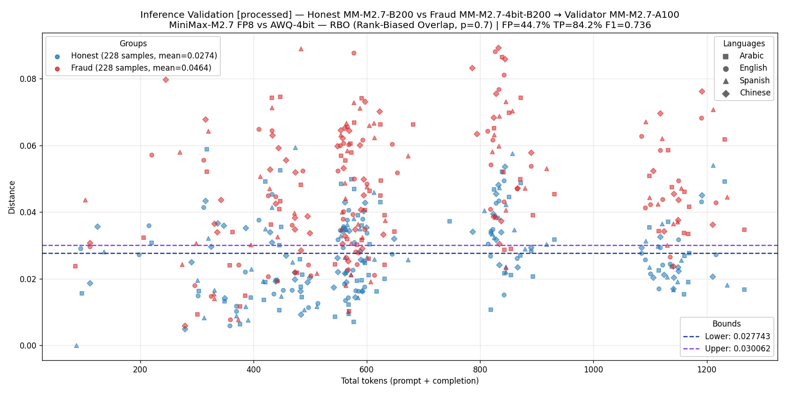
**Figure 8.** B200 executor, A100 validator, `processed`. F1 = 0.732.

### Validator = B200

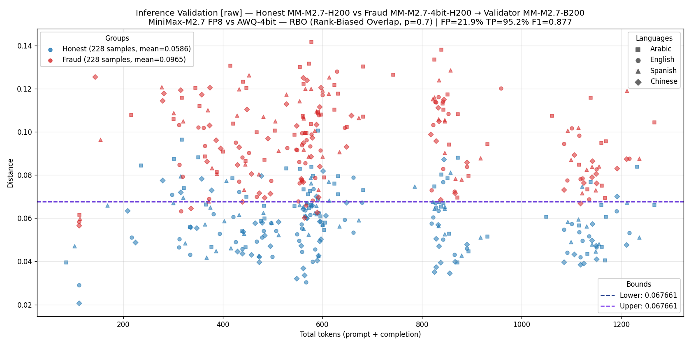
**Figure 9.** H200 executor, B200 validator, `raw`. F1 = 0.877.

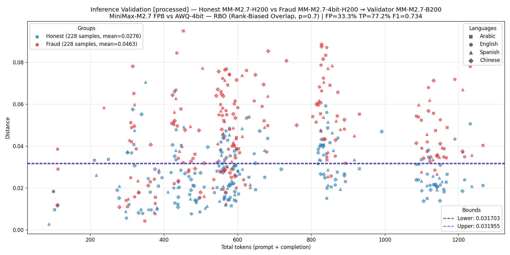
**Figure 10.** H200 executor, B200 validator, `processed`. F1 = 0.734.

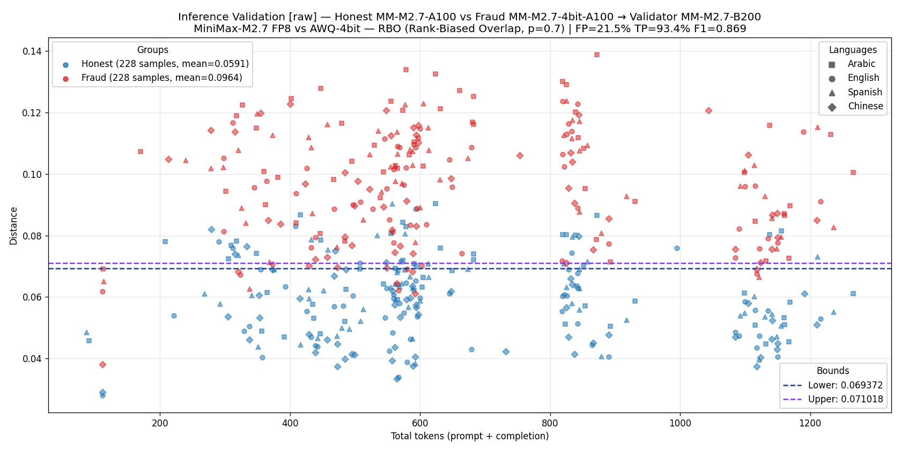
**Figure 11.** A100 executor, B200 validator, `raw`. F1 = 0.869.

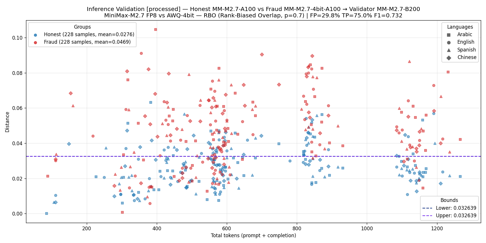
**Figure 12.** A100 executor, B200 validator, `processed`. F1 = 0.736.

## Reproducing

From the repo root:

```bash
python3 -m e2e.plot_inference_experiments --metric rbo
```

Reads the existing `inference-*.json` and `validated-by-*-1.json` files in `artifacts/2026-06-07/` — no GPU access required.
