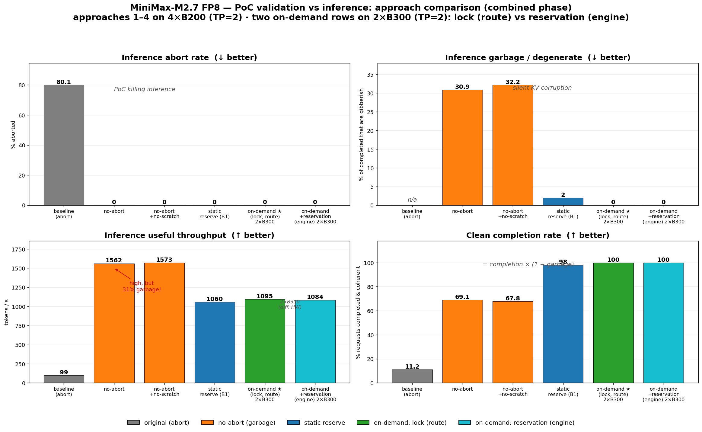
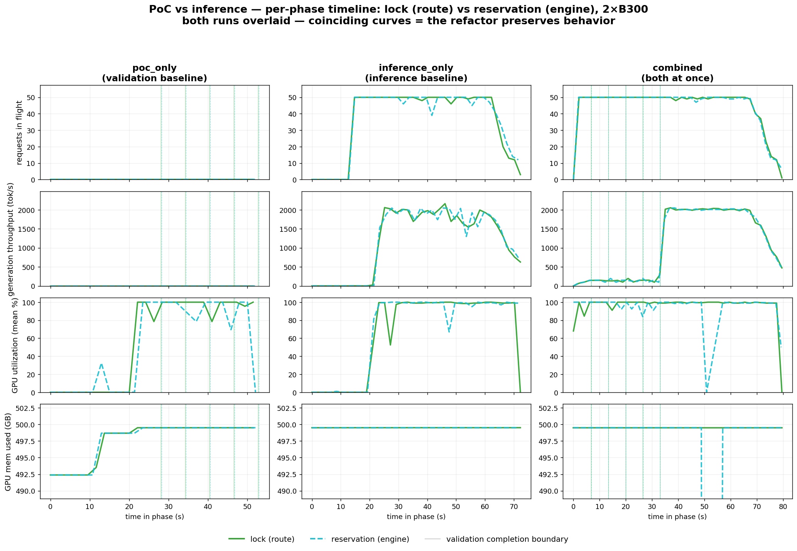
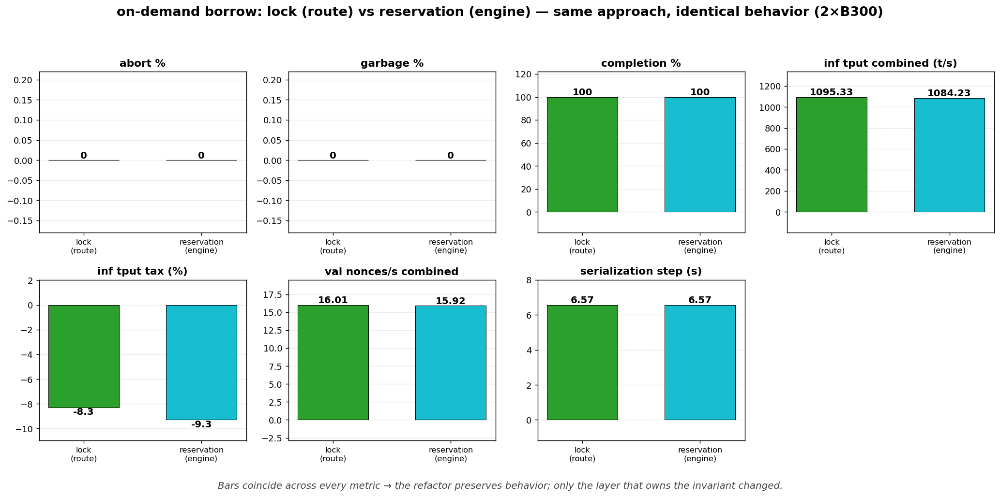

# PoC validation vs inference — results (2026-06-17, MiniMax-M2.7 FP8)

Can PoC validation (`POST /api/v1/pow/generate`) run **at the same time** as
inference (`POST /v1/chat/completions`) on one vLLM server without aborting
inference and without corrupting its output? These are the runs that answer it.

Each run is the 3-phase `e2e.poc_inference` harness: `poc_only` (validation
baseline) → `inference_only` (inference baseline) → `combined` (both at once,
the interference measurement). All numbers below are the **combined** phase
unless stated.

Workload: 5 validations × 256 nonces, 50 in-flight inference, `seq_len=1024`,
`k_dim=12`. Verdicts use the **on-chain** PoC-v2 stat-test
(`dist_threshold=0.4`, `p_mismatch=0.02`, `fraud_threshold=0.01`), not the
strict server defaults. Self/cross reference: `poc-references/minimax-m27-fp8-2xb200.json`.

---

## The headline: how each coexistence approach behaves under load

| approach | HW | abort | garbage¹ | clean completion² | inf tput base → combined | inf tput tax |
|---|---|---:|---:|---:|---:|---:|
| **baseline (abort)** — stock mlnode PoC | 4×B200 | **80.1 %** | n/a | **11.2 %** | 1495 → 99 t/s | **−93.4 %** |
| no-abort (coexist, shared KV) | 4×B200 | 0 % | 30.9 % | 69.1 % | 1637 → 1562 t/s | −4.5 % |
| no-abort + no-scratch | 4×B200 | 0 % | 32.2 % | 67.8 % | 1668 → 1573 t/s | −5.7 % |
| static reserve (B1 disjoint blocks) | 4×B200 | 0 % | 2.0 % | 98.0 % | 1502 → 1060 t/s | −29.4 % |
| **on-demand borrow** (B200) | 4×B200 | 0 % | 0.7 % | 99.3 % | 1515 → 1048 t/s | −30.8 % |
| **on-demand borrow + lock (route)** ★ | 2×B300 | **0 %** | **0.0 %** | **100 %** | 1195 → 1095 t/s | **−8.3 %** |
| **on-demand borrow + reservation (engine)** | 2×B300 | **0 %** | **0.0 %** | **100 %** | 1195 → 1084 t/s | **−9.3 %** |

¹ `garbage` = fraction of *completed* inferences whose output is degenerate
(gibberish / repetition) — i.e. **silent KV corruption**. A high tput with high
garbage is worthless.
² `clean completion` = `completion_rate × (1 − garbage)` — the only metric that
captures both "did it finish" and "is the answer real".

The same data as bars (↓ better for abort / garbage, ↑ better for throughput /
clean completion).

### Reading the table

- **Stock PoC aborts inference** — 80 % of inferences killed, throughput
  collapses 93 %. This is the problem we set out to fix.
- **Naive no-abort is a trap** — zero aborts and the *highest* throughput
  (1562 t/s), but **~31 % of completed outputs are garbage**: PoC's
  `execute_poc_forward` writes K/V into the same physical blocks inference is
  using, silently corrupting it. The "no-scratch" variant confirms the
  scratchpad buffer was not the cause.
- **Disjoint KV blocks fix the corruption.** Both *static reserve* (pre-reserve
  a fixed block range) and *on-demand borrow* (reserve blocks per validation,
  return them after) drop garbage to ≤2 %.
- **On-demand borrow wins** — it doesn't permanently hold a reserved range, so
  inference keeps more KV; on B300 with the validation lock it lands at **0
  aborts, 0 garbage, 100 % clean completion, only −8 % inference tput**.

> **Caveat on the throughput column:** approaches 1–5 are 4×B200 (TP=2); the
> winning row is 2×B300 (TP=2). The *quality* metrics (abort / garbage /
> completion) are hardware-independent and directly comparable; the absolute
> `t/s` numbers are not — that is why the B300 tax (−8 %) looks better than the
> B200 on-demand tax (−31 %). Same approach, different box and KV budget.

---

## Validation throughput under inference load

Validation is the background job, so its slowdown is acceptable as long as
verdicts stay correct. On the 2×B300 run (5 validations fired **concurrently**):

| phase | validation nonces/s | inference tput | mismatch | verdict |
|---|---:|---:|---:|---|
| `poc_only` (no inference) | 24.3 | — | 0 | pass |
| `combined` (50 inf in-flight) | 16.0 | 1095 t/s | 0 | pass |

Validation slows ~34 % while inference runs, **mismatch stays 0** (no false
fraud), and inference loses only ~8 %. Both sides make progress; neither breaks.

---

## GPU memory / utilization (2×B300, `nvidia-smi` over SSH)

| phase | VRAM used (peak) | VRAM used (mean) | GPU util (mean) |
|---|---:|---:|---:|
| `poc_only` | 499.5 GB | 497.7 GB | 58.1 % |
| `inference_only` | 499.5 GB | 499.5 GB | 66.3 % |
| `combined` | 499.5 GB | 499.5 GB | **95.8 %** |

VRAM is **flat across phases** — vLLM preallocates the KV cache at startup
(`gpu_memory_utilization=0.92`), so memory pressure doesn't show up as VRAM
growth. The real contention signal is **GPU utilization**: 58 % → 66 % →
**95.8 %** as the two workloads stack. On-demand borrow takes its KV blocks from
inside that preallocated pool (~1.5 % of it, peak 1×R), which is why there's no
OOM.

---

## Per-phase timeline

`server_samples` over each phase — requests in flight, generation throughput,
GPU utilization, GPU memory. **Both 2×B300 runs are overlaid**: lock (route,
green solid) and reservation (engine, teal dashed); vertical lines mark each
validation's completion boundary per run. The two curves coincide — visual proof
the refactor preserves behavior.

- **`combined`:** inference holds 50 requests in flight for the entire phase
  (no aborts), and throughput is suppressed **only inside** the validation
  window (0 → ~33 s), snapping back to ~2000 tok/s the moment validations finish
  — the ~−9 % tax is concentrated there, not smeared across the run.
- **GPU memory is flat in all three phases** — vLLM preallocates the KV pool, so
  on-demand borrow shows up as utilization contention, never as VRAM growth.

---

## Validation serialization — lock (route) → reservation (engine)

Concurrent validations are serialized so they queue instead of stacking N×R KV
reservations (peak stays **1×R**). All 5 validations are fired at once
(`validation_concurrency=5`) and complete on a uniform ~6.6 s **staircase** in
`end_s` — strict serialization, exactly as intended.

Two implementations were measured, both on 2×B300:

- **lock (route)** — `_poc_validation_lock` (`asyncio.Lock`) in the HTTP
  `/generate` route, wrapping reserve → forwards → free by hand.
- **reservation (engine)** — `poc_reservation` async context manager in the
  engine client (`engine_patch.py`), which owns the lock + reserve + return as
  one atomic unit. The route just `async with engine.poc_reservation(...)`. This
  moves the invariant next to the resource it protects and makes the block
  return impossible to forget.

Every metric coincides (abort 0 / garbage 0 / completion 100 % / staircase
6.57 s / val nonces/s 16.0 vs 15.9 / tax −8.3 % vs −9.3 %) — the refactor is a
pure structural move, behavior unchanged. `abort=0` itself proves the engine CM
is actually used (a missing `poc_reservation` would fall back to the abort path
and spike the abort rate).

> **Known limitation (both):** the lock is per API-server process. With
> `--api-server-count > 1` the cap degrades to P×R — a cross-process bound must
> live in `EngineCore` (the single owner of the block pool).

---

Approaches by directory suffix: `4xb200` = stock abort baseline · `noabort` /
`noscratch` = shared-KV (garbage) · `reserved` = static disjoint reserve ·
`ondemand` = on-demand borrow (final). `2xb300-ondemand` = winning approach on
B300 with the route-level lock; `2xb300-refactor` = same approach after moving
serialization into the engine-level `poc_reservation` context manager (the
lock-vs-reservation comparison above).
