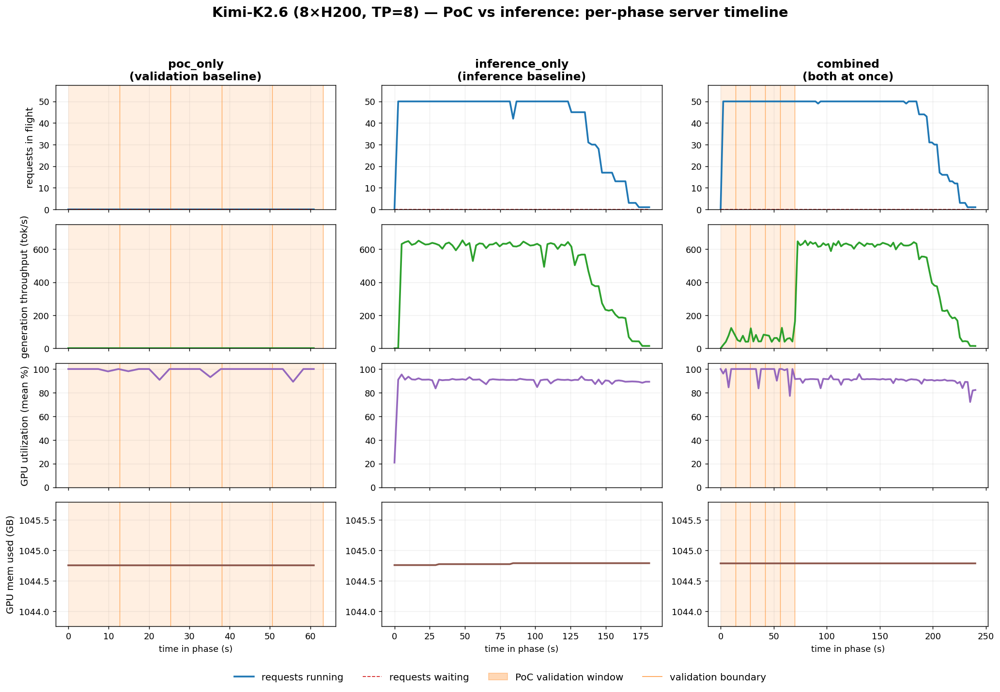

# PoC validation vs inference — results (2026-06-19, Kimi-K2.6, 8×H200)

Does the on-demand-borrow + `poc_reservation` PoC patch (proven on MiniMax-M2.7,
see [`../2026-06-17/`](../2026-06-17/README.md)) also let PoC validation
(`POST /api/v1/pow/generate`) coexist with inference (`POST /v1/chat/completions`)
on **Kimi-K2.6** — a much larger model with **MLA** attention and **INT4
compressed-tensors** MoE — without aborting inference or corrupting its output?

3-phase `e2e.poc_inference` run: `poc_only` (validation baseline) →
`inference_only` (inference baseline) → `combined` (both at once). All numbers
below are the **combined** phase unless stated.

- **Hardware:** 8×H200 (TP=8), `ghcr.io/gonka-ai/mlnode:3.0.14-cu129` + the 4-file
  on-demand-borrow patch (`poc_reservation`).
- **Backend:** FLASHMLA (Hopper MLA; KV `block_size=64`), INT4 compressed-tensors
  MoE auto-detected (Marlin). Deploy details + gotchas: [`../../docs/kimi.md`](../../docs/kimi.md).
- **Workload:** 5 validations × 256 nonces fired concurrently, 50 in-flight
  inference, `seq_len=1024`, `k_dim=12`, on-chain stat-test
  (`dist 0.4 / p_mismatch 0.02 / fraud 0.01`), self-validation.

---

## Verdict — all three criteria pass

| criterion | want | result |
|---|---|---|
| inference **abort rate** | 0 | **0.00 %** ✅ |
| inference **garbage** (degenerate output) | 0 | **0.00 %** ✅ |
| validation **serialization** (lock) | uniform staircase | end_s `13.95 → 27.93 → 41.93 → 55.92 → 69.91` s — steps **~13.98 s**, peak KV reservation 1×R ✅ |
| validation **mismatch / fraud** | within tolerance | `[0,1,0,1,2]` /256 (≤0.8 %, under 2 % honest rate), fraud=none ✅ |
| inference completion | — | 100 % |

The on-demand-borrow approach holds on Kimi's MLA + INT4 stack: PoC's
`execute_poc_forward` writes into borrowed disjoint KV blocks, so inference KV is
never corrupted (0 garbage) and inference is never aborted (0 abort). The
serializing `poc_reservation` lock keeps peak validation KV at 1×R — the uniform
~13.98 s end-time staircase is five validations queued one at a time.

---

## Interference tax

| metric | baseline | combined | change |
|---|---:|---:|---:|
| inference throughput | 497.5 t/s | 374.6 t/s | **−24.7 %** |
| validation throughput | 20.3 nonces/s | 5.3 nonces/s | −74 % |

Both sides keep making progress; neither breaks. The tax is larger than
MiniMax-M2.7's (−8 %): Kimi is bigger and slower (baseline 497 vs 1195 t/s) and
its MLA validations are heavier, so the two workloads contend harder for the same
SMs. Correctness is unaffected — the cost is pure throughput, concentrated inside
the validation window (see timeline).

---

## GPU memory / utilization (8×H200, `nvidia-smi` over SSH)

| phase | VRAM used | GPU util (mean) |
|---|---:|---:|
| `poc_only` | 1044.8 GB | 98.8 % |
| `inference_only` | 1044.8 GB | 89.5 % |
| `combined` | 1044.8 GB | 92.1 % |

VRAM is **flat across all phases** — vLLM preallocates the KV pool at startup
(`gpu_memory_utilization=0.90` → 1044.8 GB of 8×140 GB; weights 71.2 GiB/GPU, KV
cache 711,296 tokens, max concurrency 5.93× @ 120k ctx). On-demand borrow takes
its blocks from inside that preallocated pool, so it shows up as utilization
contention, never as VRAM growth.

---

## Per-phase timeline



`server_samples` over each phase. Orange = the PoC validation window; vertical
lines mark the boundary between the five serialized validations.

- **`combined`:** inference holds 50 requests in flight for the whole phase (no
  aborts); throughput is suppressed **only inside** the validation window
  (0 → ~70 s) and recovers to ~600 tok/s once validations finish.
- **GPU memory is flat in all three phases** — preallocated KV pool; coexistence
  shows up as utilization, not VRAM.

Regenerate: `../../.venv/bin/python make_kimi_timeline.py`

---

## Files

```
Kimi-K2.6-8xh200/poc-inference/
  poc_only.json / inference_only.json / combined.json   per-phase records + summaries + GPU samples
  comparison.json / comparison.md                       3-way deltas
  quality_samples.json                                  baseline vs combined output text
kimi_phase_timeline.png                                 the timeline above
make_kimi_timeline.py                                   regenerates it from the JSONs
```

Only the timeline is reproduced here (not the MiniMax multi-approach bar charts):
Kimi was run with a single approach — on-demand borrow + reservation — so there
is nothing to compare it against on this box.
